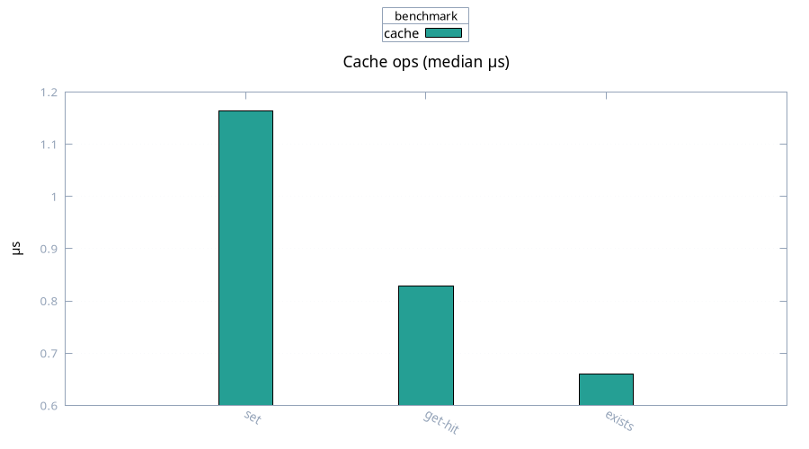

# Cache

Medians, 100 samples. In-memory set, hit, and exists.

| Case | Median | Mean |
| ---- | ------ | ---- |
| set | 1.16 µs | 1.47 µs |
| get hit | 0.83 µs | 0.87 µs |
| exists | 0.66 µs | 0.73 µs |

