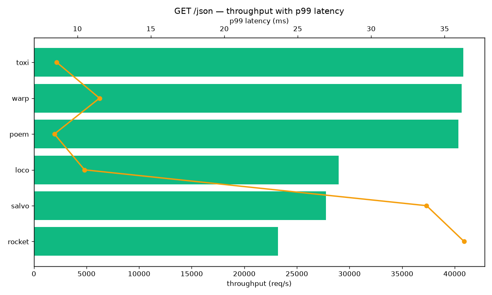

# Full HTTP Comparison

GET /json returning `{"message":"Hello, World!"}`, oha 30 s, 125
connections, loopback, release builds. Success rate 1.0 everywhere.

| Framework | Req/s | p99 (ms) |
| --------- | ----: | -------: |
| toxi | 40,812 | 8.60 |
| warp | 40,681 | 11.51 |
| poem | 40,359 | 8.44 |
| loco | 28,994 | 10.49 |
| salvo | 27,759 | 33.78 |
| rocket | 23,207 | 36.34 |

