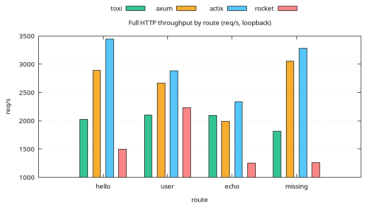
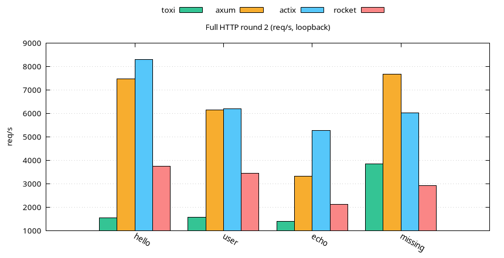

# Full HTTP Comparison

Loopback, oha 15 s, 50 connections. Identical routes in all four
servers. Success rate 1.0 everywhere. Requests per second.

## Round 1 (shared box, load 17–24)

| Route | Toxi | Axum | Actix | Rocket |
| ----- | ---- | ---- | ----- | ------ |
| GET /hello | 2,019 | 2,890 | 3,449 | 1,490 |
| GET /users/42 | 2,099 | 2,661 | 2,885 | 2,229 |
| POST /echo | 2,092 | 1,984 | 2,334 | 1,251 |
| GET /missing | 1,817 | 3,055 | 3,279 | 1,258 |

## Round 2 (taskset-isolated, back-to-back)

| Route | Toxi | Axum | Actix | Rocket |
| ----- | ---- | ---- | ----- | ------ |
| GET /hello | 1,552 | 7,478 | 8,282 | 3,747 |
| GET /users/42 | 1,562 | 6,144 | 6,204 | 3,447 |
| POST /echo | 1,407 | 3,310 | 5,270 | 2,108 |
| GET /missing | 3,844 | 7,668 | 6,009 | 2,909 |

