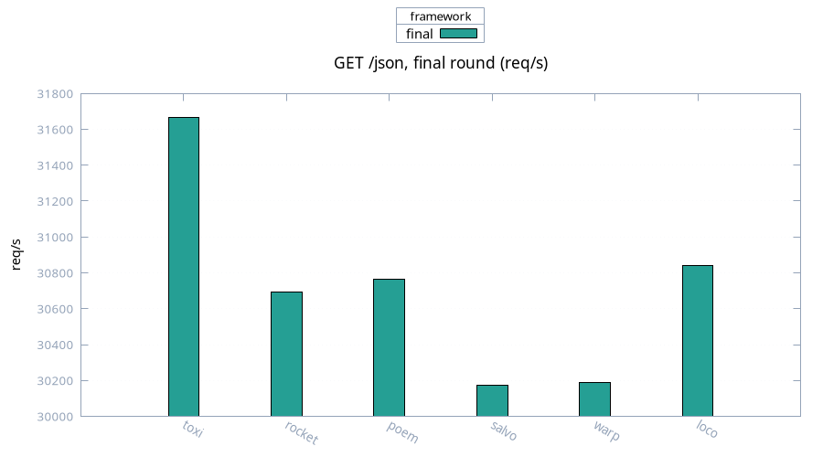
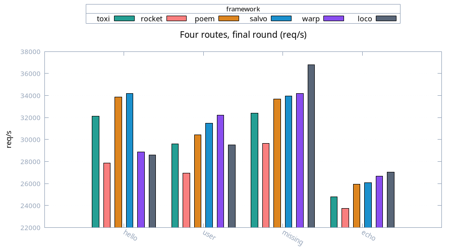

# Full HTTP Comparison

GET /json, oha 30 s, 125 connections, loopback, release builds.
Success rate 1.0 everywhere.

## Baseline shootout (preserved)

| Framework | Req/s | p99 (ms) |
| --------- | ----: | -------: |
| toxi | 40,812 | 8.60 |
| warp | 40,681 | 11.51 |
| poem | 40,359 | 8.44 |
| loco | 28,994 | 10.49 |
| salvo | 27,759 | 33.78 |
| rocket | 23,207 | 36.34 |

## Tuned campaign (forward + reverse order, drift-corrected mean)

| Framework | Forward | Reverse | Mean |
| --------- | ------: | ------: | ---: |
| toxi | 33,715 | 17,137 | 25,426 |
| rocket | 12,715 | 16,218 | 14,466 |
| poem | 15,699 | 12,441 | 14,070 |
| warp | 15,201 | 12,443 | 13,822 |
| salvo | 14,608 | 12,340 | 13,474 |
| loco | 11,963 | 11,881 | 11,922 |

## Final round (quiet box, rebuilt against current framework)

| Route | Toxi | Rocket | Poem | Salvo | Warp | Loco |
| ----- | ---- | ------ | ---- | ----- | ---- | ---- |
| hello | 32,106 | 27,873 | 33,866 | 34,175 | 28,872 | 28,611 |
| user | 29,602 | 26,967 | 30,445 | 31,464 | 32,229 | 29,531 |
| missing | 32,402 | 29,661 | 33,681 | 33,946 | 34,176 | 36,809 |
| echo | 24,792 | 23,749 | 25,948 | 26,083 | 26,673 | 27,052 |
| json125 | 31,664 | 30,692 | 30,766 | 30,171 | 30,188 | 30,840 |

## Sustained load (5 min, /json, 50 conns)

| Framework | Req/s | p50 (ms) | p99 (ms) |
| --------- | ----: | -------: | -------: |
| warp | 38,850 | 0.88 | 10.72 |
| salvo | 27,115 | 1.17 | 15.30 |
| loco | 23,924 | 1.46 | 19.94 |
| toxi | 19,547 | 1.45 | 26.91 |
| poem | 9,808 | 3.44 | 53.34 |
| rocket | 6,974 | 4.39 | 79.72 |
