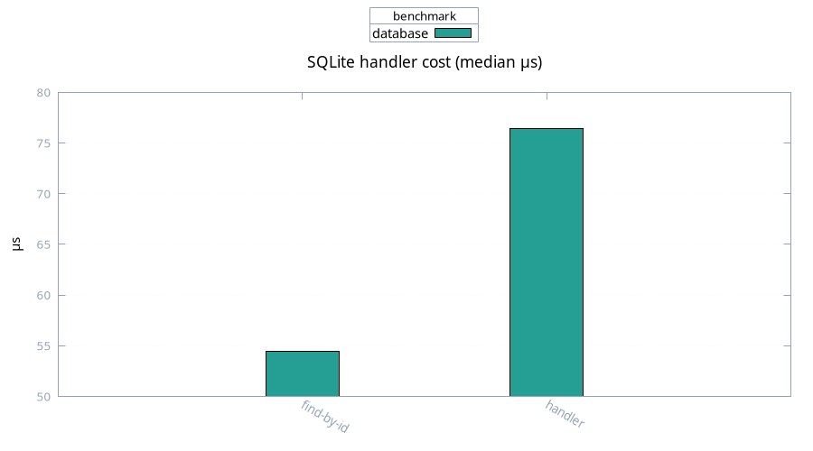

# Database

Medians, 100 samples. SQLite in-memory through toxi-db, 100 rows.

| Case | Median | Mean |
| ---- | ------ | ---- |
| single-row fetch | 54.4 µs | 58.5 µs |
| fetch through router + state | 76.4 µs | 227 µs |

