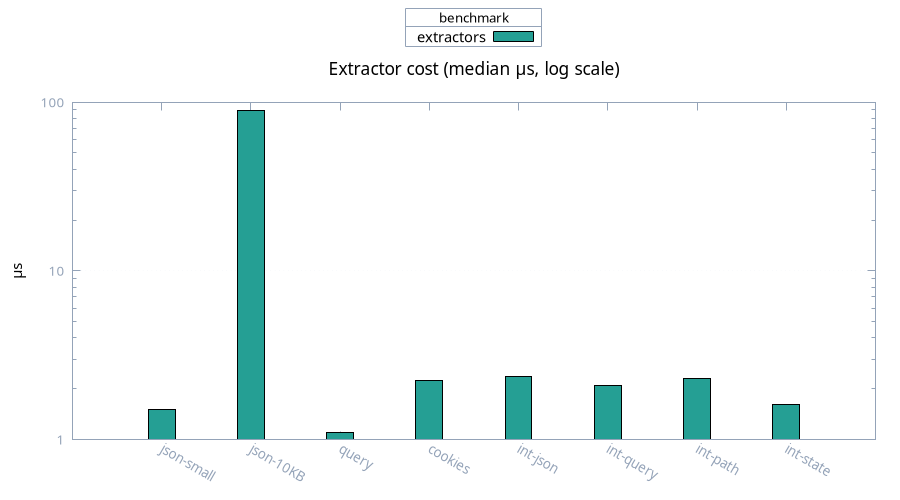

# Extractors

Medians, 100 samples.

| Case | Median | Mean |
| ---- | ------ | ---- |
| micro JSON small | 1.50 µs | 1.29 µs |
| micro JSON 10 KB | 89.5 µs | 72.6 µs |
| micro query | 1.10 µs | 1.13 µs |
| micro cookies (5) | 2.24 µs | 2.28 µs |
| integrated JSON | 2.37 µs | 3.11 µs |
| integrated query | 2.09 µs | 2.35 µs |
| integrated path | 2.30 µs | 2.93 µs |
| integrated state | 1.62 µs | 1.91 µs |

