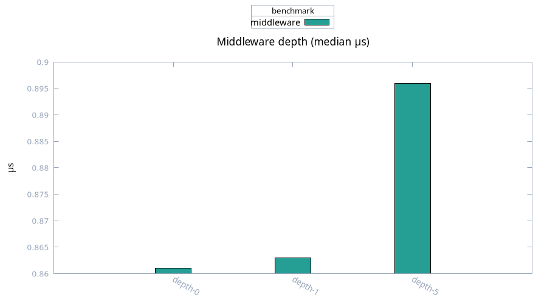

# Middleware

Medians, 100 samples. Passthrough layer at three depths.

| Depth | Median | Mean |
| ----- | ------ | ---- |
| 0 layers | 0.86 µs | 1.43 µs |
| 1 layer | 0.86 µs | 0.96 µs |
| 5 layers | 0.90 µs | 1.20 µs |

