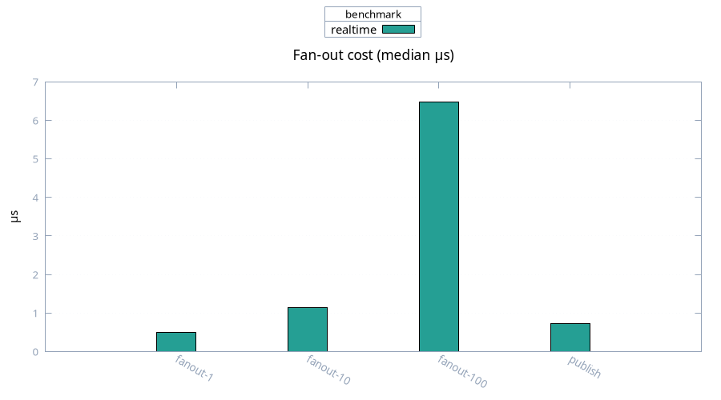

# Realtime

Medians, 100 samples. Broadcast fan-out with pub/sub publish.

| Case | Median | Mean |
| ---- | ------ | ---- |
| fan-out, 1 conn | 0.50 µs | 0.56 µs |
| fan-out, 10 conns | 1.15 µs | 1.35 µs |
| fan-out, 100 conns | 6.47 µs | 7.27 µs |
| pub/sub publish | 0.72 µs | 1.08 µs |

