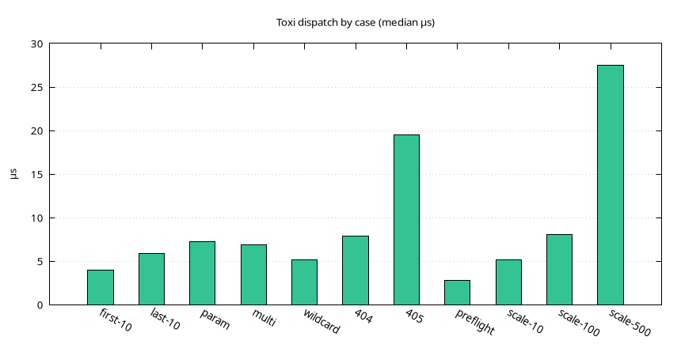
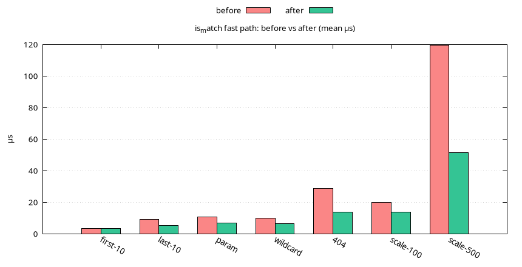

# Router

Medians. Loaded runs: 100 samples. Quiet-box reruns: 50+ samples,
machine load near 1.

| Case | Loaded | Quiet box |
| ---- | ------ | --------- |
| static first of 10 | 4.02 µs | 1.00 µs |
| static last of 10 | 5.93 µs | — |
| param `/users/42` | 7.29 µs | — |
| multi-param | 6.88 µs | 1.64 µs |
| wildcard | 5.15 µs | — |
| 404, 100 routes | 7.90 µs | — |
| 405 wrong method | 19.52 µs | 3.79 µs |
| OPTIONS preflight | 2.80 µs | — |
| last hit, 10 routes | 5.18 µs | — |
| last hit, 100 routes | 8.11 µs | — |
| last hit, 500 routes | 27.49 µs | — |

`is_match` fast path, before → after (means): first-10 3.57 → 3.27,
last-10 9.01 → 5.31, param 10.84 → 6.79, wildcard 10.07 → 6.62,
404 28.64 → 13.68, scale-100 19.93 → 13.70, scale-500 119.61 → 51.29.

