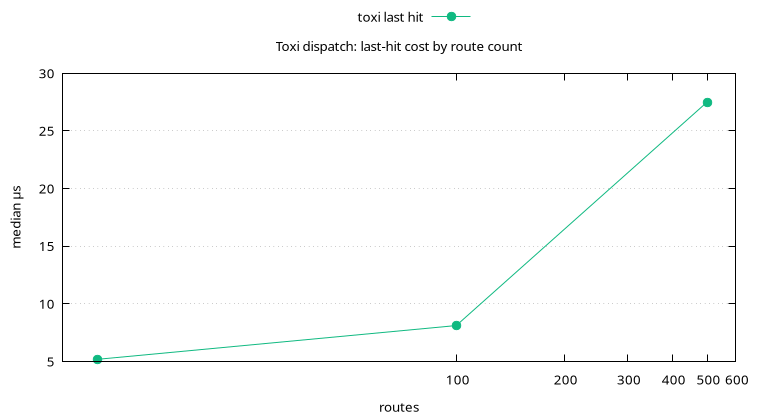

# Router

Medians, 100 samples.

| Case | Median | Mean |
| ---- | ------ | ---- |
| static first of 10 | 4.02 µs | 4.04 µs |
| static last of 10 | 5.93 µs | 7.11 µs |
| param `/users/42` | 7.29 µs | 115 µs |
| multi-param | 6.88 µs | 13.5 µs |
| wildcard | 5.15 µs | 5.99 µs |
| 404, 100 routes | 7.90 µs | 9.15 µs |
| 405 wrong method | 19.52 µs | 359 µs |
| OPTIONS preflight | 2.80 µs | 247 µs |
| last hit, 10 routes | 5.18 µs | 6.48 µs |
| last hit, 100 routes | 8.11 µs | 9.11 µs |
| last hit, 500 routes | 27.49 µs | 29.12 µs |

