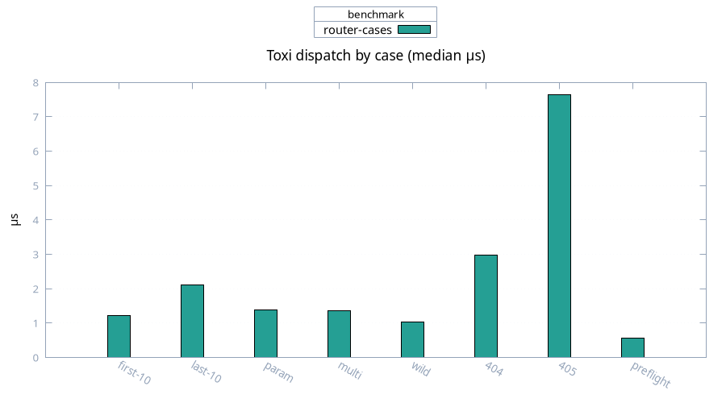
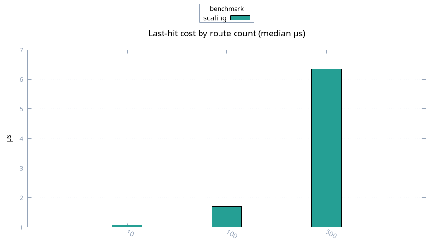

# Router

Medians, 100 samples.

| Case | Median | Mean |
| ---- | ------ | ---- |
| static first of 10 | 1.23 µs | 1.54 µs |
| static last of 10 | 2.11 µs | 2.58 µs |
| param `/users/42` | 1.38 µs | 2.57 µs |
| multi-param | 1.35 µs | 1.78 µs |
| wildcard | 1.03 µs | 1.26 µs |
| 404, 100 routes | 2.98 µs | 3.47 µs |
| 405 wrong method | 7.64 µs | 11.8 µs |
| OPTIONS preflight | 0.56 µs | 0.60 µs |
| last hit, 10 routes | 1.09 µs | 1.35 µs |
| last hit, 100 routes | 1.71 µs | 2.01 µs |
| last hit, 500 routes | 6.35 µs | 7.26 µs |

