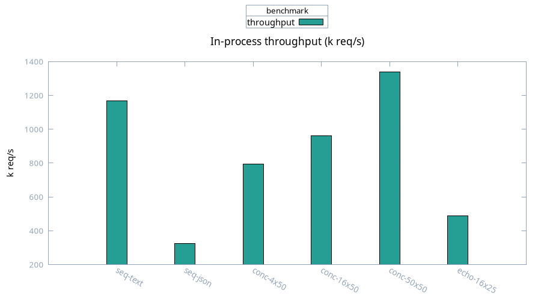

# Throughput

Medians, 100 samples. Concurrent dispatch fan-out, no TCP.

| Case | Batch median | Derived req/s |
| ---- | ------------ | ------------- |
| sequential text (1 req) | 0.86 µs | ~1,167,000 |
| sequential JSON (1 req) | 3.09 µs | ~324,000 |
| 4 tasks × 50 (200 reqs) | 252 µs | ~793,000 |
| 16 tasks × 50 (800 reqs) | 832 µs | ~961,000 |
| 50 tasks × 50 (2500 reqs) | 1.87 ms | ~1,338,000 |
| echo 16 × 25 (400 reqs) | 821 µs | ~487,000 |

