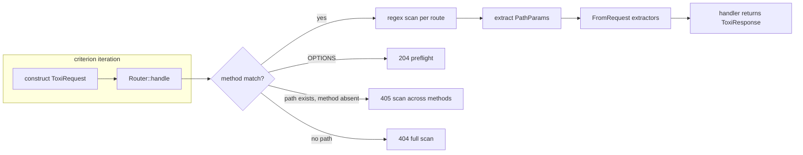
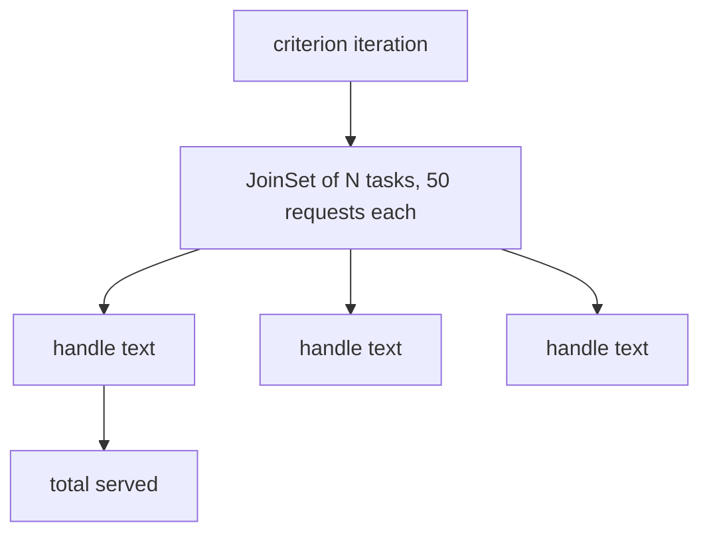

# Benchmarks for `toxi-core`

## 1. Background

`toxi-core` provides the HTTP kernel of the Toxi framework, which comprises
routing, request extraction, response construction, middleware composition,
and the server adapter. Although functional correctness of these components
is established through the existing test suite, correctness alone does not
establish suitability under load, since dispatch cost, extraction cost, and
serialization cost interact in ways that cannot be predicted reliably from
code inspection without controlled measurement.

The present suite therefore subjects the request path to systematic
benchmarking. It builds upon the criterion harness, which is a widely
adopted measurement framework for Rust, and which records sample
distributions with HTML reporting that permits independent verification of
reported figures. The suite confines itself to in-process measurement through
direct invocation of `Router::handle`, without TCP transport, in order to
isolate framework cost from loopback and scheduler variation that would
otherwise confound comparison on limited hardware.

## 2. Statement of the problem

The router matches each incoming request through a linear scan over
per-method route vectors, in which each route carries a compiled regular
expression. Although this design is straightforward to reason about, its cost
grows with route count, with the consequence that applications with several
hundred routes may exhibit dispatch latencies that dominate handler time.
A further problem concerns attribution, because end-to-end latency conflates
routing with extraction and serialization, with the result that optimization
directed at JSON serialization alone may yield negligible improvement where
routing constitutes the binding constraint.

The suite addresses these problems by separating the dispatch path from its
surrounding stages, namely by measuring static hits at distinct scan
positions, dynamic segment extraction, miss paths that require full scans,
extractor performance both in isolation and through the router, response
construction across representative payload sizes, per-layer middleware cost,
and concurrent throughput under fan-out.

## 3. Objectives

The general objective is to establish a reproducible performance baseline for
`toxi-core` that subsequent modifications can be compared against, and that
examiners of the framework can re-execute from documented invocations.

The specific objectives, which operationalise the general objective, are as
follows.

To quantify routing cost for static hits, for parameterised paths of the
form `/users/:id`, for multi-parameter paths, and for wildcard paths, with
explicit comparison between best-case and worst-case scan positions.

To quantify the cost of miss paths, namely 404 responses that require a full
scan with a subsequent allowed-methods scan, 405 responses that require
cross-method matching, and preflight handling, since these paths are
frequently overlooked although they determine behaviour under scanning and
misconfiguration.

To quantify scaling with route count at 10, 100, and 500 static routes with
measurement at the last route, in order to render the linear character of
the scan observable rather than asserted.

To quantify extractor cost both at the micro level through direct invocation
of `FromRequest::from_request` and at the integrated level through
`Router::handle`, for JSON payloads of small and approximately 10 kilobyte
sizes, for query strings, for path parameters, for cloned application state,
and for cookie headers, because micro and integrated figures diverge where
routing dominates parsing.

To quantify response construction for JSON values of small, medium, and
large (1000-row) sizes, for plain text, for HTML, and for error conversion,
since serialization constitutes the principal cost of list endpoints.

To quantify middleware composition cost through a passthrough layer at
depths of zero, one, and five, which establishes the per-layer budget within
which substantive middleware such as logging and authentication must operate.

To quantify concurrent throughput through fan-out of `Router::handle` across
4, 16, and 50 tokio tasks, for text, for JSON, and for an echo handler that
combines parsing with serialization, with reporting in requests per second.

## 4. Architecture under test

The dispatch sequence that the suite exercises is represented as follows,
in which each stage corresponds to a measurable component.



Concurrent throughput fans the handler invocation across tasks, which
exercises shared-reference contention in addition to per-request cost.



## 5. Methodology

### 5.1 Measurement protocol

Latency benches employ a current-thread tokio runtime, which avoids
scheduler migration that would otherwise inflate variance on a four-core
machine. The throughput bench employs a multi-thread runtime, since fan-out
cannot be observed meaningfully on a single thread. Each latency iteration
constructs a fresh request through `iter_batched`, because `Router::handle`
consumes its request by value, with the consequence that reuse across
iterations is not permitted. Payloads that are shared across iterations are
passed through `black_box`, which prevents constant folding without
altering the measured path.

Short runs of five seconds with fifty samples are prescribed for iteration
during development, whereas full runs with default sample counts are
prescribed for published figures. Baselines are recorded through
`--save-baseline main` prior to modification and are compared through
`--baseline main` thereafter.

### 5.2 Execution

```bash
# Complete suite. The http3 feature is disabled because the QUIC stack
# dominates cold compilation without contributing to the measured path.
cargo bench -p toxi-core --no-default-features

# Compilation check without execution.
cargo bench -p toxi-core --no-default-features --bench router -- --test

# Single suite with reduced measurement for rapid iteration.
cargo bench -p toxi-core --no-default-features --bench router -- --measurement-time 5 --sample-size 50

# Baseline recording and subsequent comparison.
cargo bench -p toxi-core --no-default-features -- --save-baseline main
# ... modify framework code ...
cargo bench -p toxi-core --no-default-features -- --baseline main
```

### 5.3 Graphical reporting

Criterion writes per-bench HTML reports that contain distribution plots and
regression summaries, which constitute the primary evidence for the study.

```text
target/criterion/<group>/<bench>/report/index.html
target/criterion/report/index.html
```

The overview report is to be examined in a browser following each run. For
archival purposes, the `router/scale-last-hit` chart, which is expected to
exhibit approximately linear growth with route count, and the
`throughput/concurrent-text` chart, which records requests per second
against task count, are to be preserved as screenshots with recorded
hardware details.

### 5.4 Socket-level validation

In-process figures exclude TCP, TLS, and client behaviour, with the
consequence that they overstate absolute throughput relative to deployment.
Validation through a live server with an external load generator is
therefore prescribed as a complement, although it is excluded from
continuous integration on account of its sensitivity to machine load.

```bash
cargo run -p toxi --example hello-world &
oha -n 50000 -c 50 http://127.0.0.1:3000/
```

In-process throughput is expected to exceed socket throughput by a factor
that reflects transport cost. Convergence between the two figures would
indicate that the bottleneck has migrated from the router to body handling
or to the client, which would require separate investigation.

## 6. Interpretation and regression criteria

A regression exceeding ten percent on `router/static-hit` or on
`extract/integrated` is to be treated as a failure that requires
investigation before merging, since these groups guard the most frequently
executed path. Growth in `router/scale-last-hit` is expected to remain
approximately linear; superlinear growth would indicate pathological
interaction among compiled patterns that warrants structural revision of
the router rather than local tuning. The per-layer delta recorded in
`middleware/passthrough` constitutes the budget for substantive middleware,
with the implication that a logging layer whose cost substantially exceeds
the passthrough delta introduces avoidable overhead in its own logic rather
than in composition.

## 7. Scope and limitations

The scope is restricted to `toxi-core` dispatch, extraction, response
construction, and composition, as measured on the laboratory machine through
the specified invocations. The study does not undertake distributed load
testing, TLS termination benchmarking, or database-backed handler
measurement, although the methodology is designed so that extension to those
domains would require principally additional harnesses rather than revision
of the recorded baselines.

The study is limited by execution on a four-core machine with constrained
memory, with the consequence that absolute figures are indicative of
relative ordering rather than definitive of production capacity, and by
reliance upon synthetic payloads whose size distribution may differ from
any particular deployment, so that direct numerical transfer to production
must be interpreted with attention to workload differences rather than as
a strict prediction.

## 8. Definition of operational terms

| Term | Operational meaning in this suite |
| ---- | --------------------------------- |
| Static hit | Dispatch to a route without parameters, measured at stated scan position |
| Last-hit scaling | Dispatch to a route registered after N static routes, which exercises worst-case scan length |
| Micro measurement | Direct invocation of `FromRequest::from_request` without routing |
| Integrated measurement | Invocation of `Router::handle` with a handler that requires the extractor |
| Passthrough layer | Minimal tower layer that forwards without logic, which isolates composition cost |
| Fan-out throughput | Concurrent invocation of `Router::handle` from N tasks, reported in elements per second |
